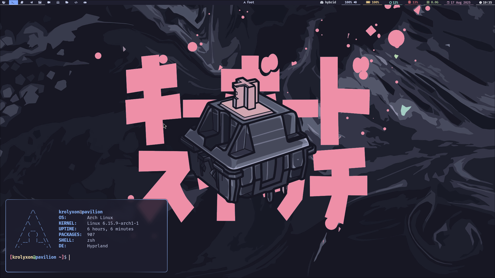
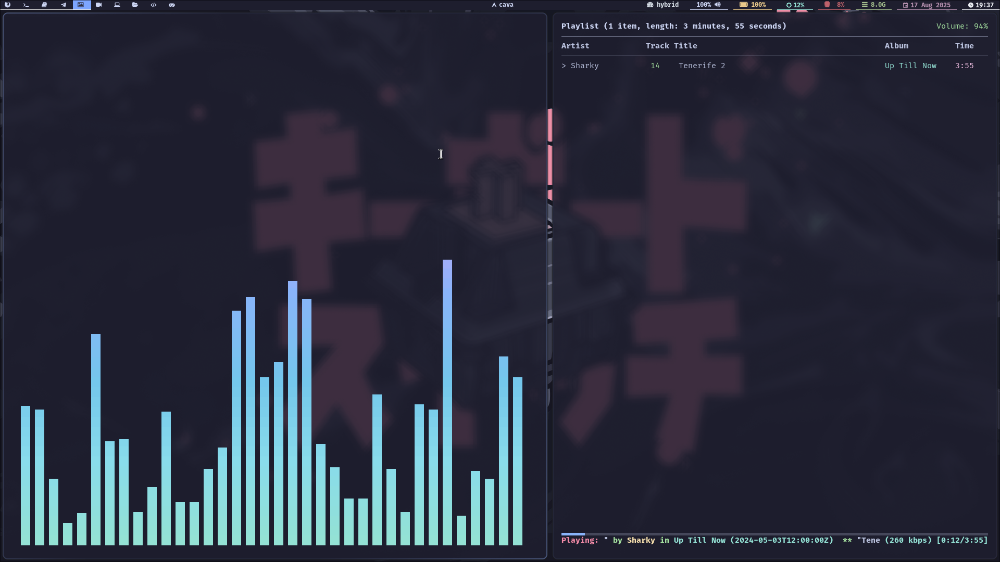

# Dotfiles




## Usage
```bash
cd $HOME
git clone https://git.krolyxon.xyz/krolyxon/dotfiles ~/.dotfiles
cd ~/.dotfiles
./install.sh

## OR ##
## Use auto-yes (you won't be asked to select any packages, everything will be selected by default)
./install.sh --yes
```
